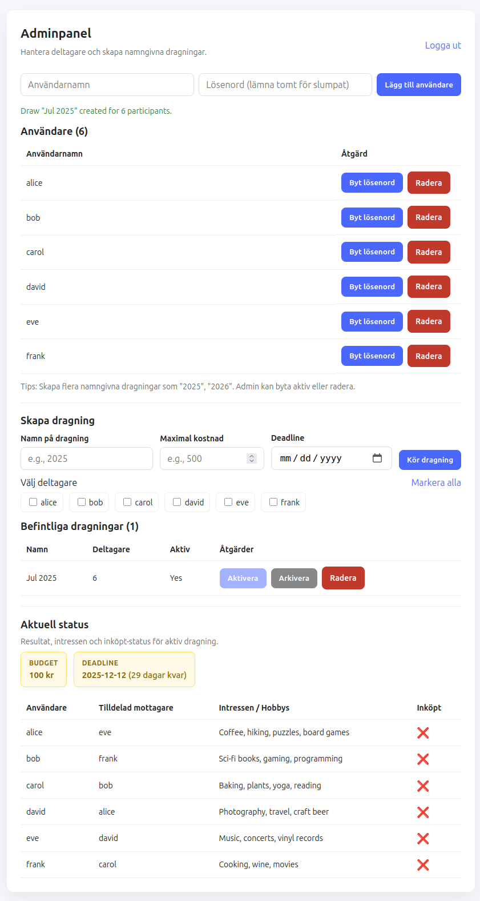
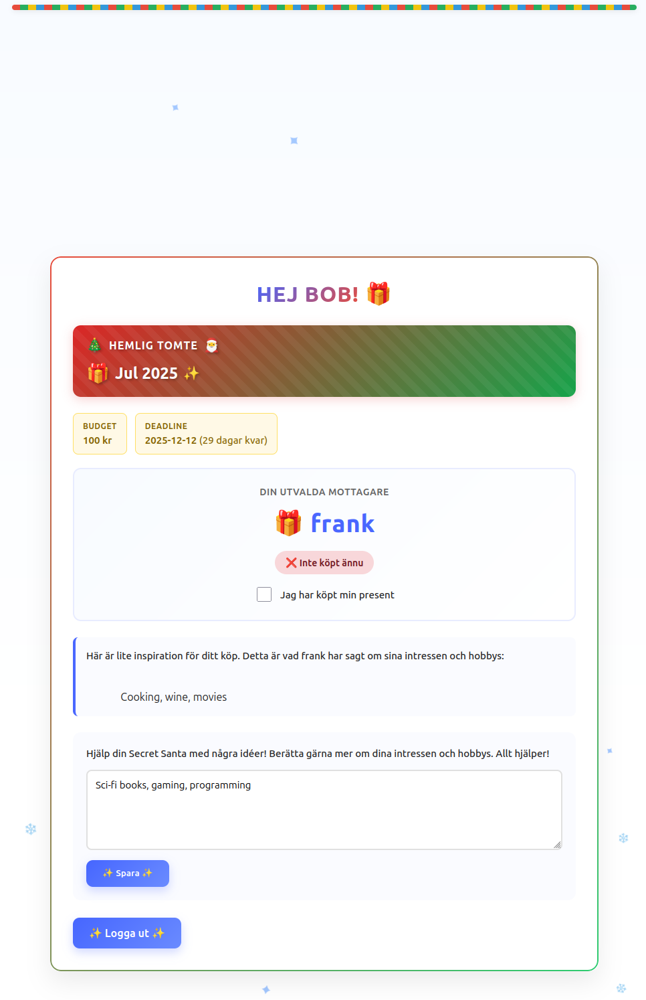

# Secret Santa / Hemlig Tomte

 En varm och enkel Hemlig Tomte-app i PHP.
 Perfekt för att ordna julens presentutbyte med vänner, familj eller kollegor, helt privat och utan krångel. 

## Skärmdumpar

### Adminpanel


### Användarvy 


## Funktioner

- 🎄 **Användarhantering**: Skapa och hantera deltagare, aktivera/inaktivera konton
- 🎁 **Skapa dragningar**: Skapa flera namngivna dragningar (t.ex. "2025", "2026")
- 🔐 **Säker autentisering**: Lösenordsskyddade användarkonton med säkra sessions
- 🔒 **Självregistrering**: Användare kan registrera sig själva (kräver admin-aktivering)
- 🔑 **Lösenordsåterställning**: Användare kan begära lösenordsåterställning (admin godkänner)
- 💰 **Budget & Deadline**: Sätt maximal presentkostnad och deadlines
- 📝 **Intresselistor**: Deltagare kan dela hobbys och intressen
- ✅ **Köpstatus**: Markera när presenter har köpts
- 📊 **Aktivitetslogg**: Spåra alla viktiga händelser i systemet
- 🌍 **Flerspråkig**: Stöd för svenska och engelska
- 🎨 **Festlig design**: Vacker jul-tematiserad användargränssnitt

## Krav

- PHP 7.4 eller högre
- Webbserver (Apache/Nginx)
- Skrivrättigheter för `data/`-katalogen

## Installation

1. Klona eller ladda ner detta repository
2. Se till att PHP-sessioner är aktiverade
3. Se till att `data/`-katalogen är skrivbar:
   ```bash
   chmod 755 data/
   ```
4. Öppna via din webbläsare

## Första gången

Vid första besöket kommer du att bli ombedd att skapa ett admin-konto:
- Användarnamn: `admin` (fastställt)
- Lösenord: Välj ditt eget lösenord (ex hunter2)

**Obs:** Om det finns exempelanvändare i `data/users.json` (t.ex. alice, bob, carol), så har dessa lösenordet `password`.

## Användning

### Adminpanel

1. Logga in med dina admin-uppgifter
2. **Lägg till användare**: Skapa deltagarkonton manuellt eller godkänn väntande registreringar
3. **Hantera användare**: Aktivera/inaktivera konton, ändra lösenord, radera användare
4. **Lösenordsåterställningar**: Godkänn eller avvisa lösenordsåterställningsbegäran
5. **Skapa dragning**: 
   - Ange dragningsnamn (t.ex. "2025")
   - Sätt valfri budget och deadline
   - Välj deltagare
   - Klicka på "Kör dragning"
6. **Hantera dragningar**: Aktivera, arkivera eller radera dragningar
7. **Visa status**: Se alla tilldelningar, intressen och köpstatus
8. **Aktivitetslogg**: Granska systemaktivitet och händelser

### Användarvy

1. **Registrera dig** (alternativt): Skapa ett konto på `register.php` (kräver admin-aktivering)
2. Logga in med ditt användarnamn och lösenord
3. Visa din tilldelade mottagare
4. Se mottagarens intressen/hobbys
5. Uppdatera dina egna intressen för att hjälpa din Secret Santa
6. Markera när du har köpt din present
7. **Glömt lösenord?**: Använd "Återställ lösenord"-länken för att begära återställning

## Filstruktur

```
hemlig-tomte/
├── index.php          # Inloggningssida & admin-installation
├── admin.php          # Adminpanel
├── view.php           # Användarvy
├── draw.php           # Dragningsskapande-hanterare
├── register.php       # Användarregistrering
├── reset.php          # Lösenordsåterställning
├── inc.php            # Översättningar, säkerhetsfunktioner & hjälpfunktioner
└── data/
    ├── users.json            # Användarkonton
    ├── pairs.json            # Dragningsdata
    ├── reset_requests.json   # Lösenordsåterställningsbegäran
    ├── activity.log          # Aktivitetslogg
    └── .htaccess             # Skydd mot direktåtkomst till JSON-filer
```

## Anpassning

- Redigera `inc.php` för att ändra översättningar (svenska/engelska)
- Modifiera CSS i varje PHP-fil för att ändra styling
- Justera säkerhetskonstanter i `inc.php` (t.ex. `MIN_PASSWORD_LENGTH`, `MAX_LOGIN_ATTEMPTS`)

## Licens

Detta projekt släpps till allmänheten under [Unlicense](UNLICENSE). Du är fri att använda, modifiera, distribuera och sälja denna programvara för vilket ändamål som helst, kommersiellt eller icke-kommersiellt, utan några begränsningar.

## Support

För problem eller frågor, kontrollera kodkommentarerna eller modifiera efter behov för ditt användningsfall.
